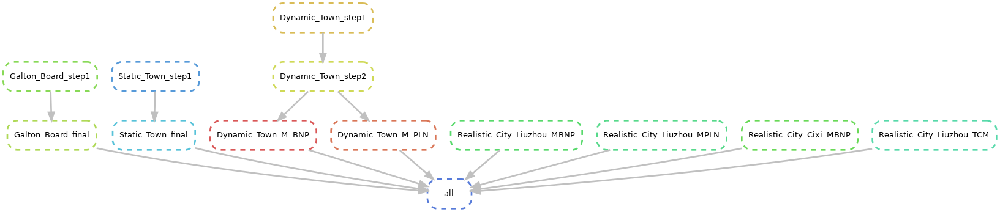

# Quick setup and run with snakemake (Recommended)
If the audience is familiar with snakemake, you can quickly set up the environment and run the simulations
## Run all rules (default)
using the following command:
```bash
snakemake --use-conda --cores 1
```
This command will create a conda environment for each rule in the Snakefile and run the simulations using the specified number of cores.

If you want to clean up the output files generated by snakemake, you can use the following command:
```bash
snakemake --delete-all-output
```

If you want to see the detailed output of the snakemake process, you can use the `-p` option:
```bash
snakemake -p --use-conda --cores 1
```
This will print the commands that are being executed, which can be helpful for debugging or understanding the workflow.

## Run single rule
If you want to run a specific rule in the Snakefile, you can use the `--rule` option followed by the name of the rule. For example, to run the `Inference` rule, you can use the following command:
```bash
snakemake --use-conda --cores 1 Galton_Board
```
This will execute only the `Inference` rule and its dependencies, allowing you to focus on a specific part of the workflow.


## Visualizing Workflow Output

To better understand the workflow, you can generate a DAG (directed acyclic graph) image. If you want to see the dag  of the workflow, you can use the `--dag` option:
```bash
snakemake --dag | dot -Tpng > dag.png
```
This will generate a PNG image of the workflow, which can be useful for visualizing the dependencies between different rules.




This image represents the dependencies and execution order of the rules in the Snakefile.


# Run Simulations Manually
If you prefer to run the simulations manually, you can follow the instructions below. This method is suitable for users who are not familiar with snakemake or prefer a more hands-on approach.
## Environment Setup
### Install Anaconda
Download and install Anaconda from the [official website](https://www.anaconda.com/). Follow the installation instructions for your operating system.


### Create Virtual Environment

Create a virtual environment using Anaconda:
```bash
conda create -n CLUSTER_env python=3.13
conda activate CLUSTER_env
```

### Requirements
Install the required Python packages:
```bash
pip install -r requirements.txt
```
## Run Simulations for Galton Board Metaphor

* Change Directory
    ```bash
    cd Galton_Board
    ```

* Run Galton Board Simulation

    Run the following command to execute the Galton Board simulation:
    ```bash
    python Simulation.py
    ```

* Make Inference

    Run the following command to make inferences on the Galton Board data:
    ```bash
    python Inference.py

## Run Simulations for Static Town
* Change Directory
    ```bash
    cd Static_Town
    ```
* Generate Data

    Run the following command to generate simulation data:
    ```bash
    python Simulation.py
    ```
* Make Inference

    Run the following command to perform inference:
    ```bash
    python Inference.py
    ```

## Run Simulations for Dynamic Town
* Change directory
    ```bash
    cd Dynamic_Town
    ```
* Generate Trajectory

    Run the following command to generate simulated trajectory for users in the dynamic town:
    ```bash
    python Trajectory_Simulation.py
    ```
* Generate User Transfer Information

    Run the following command to generate user transfer information based on the trajectories:
    ```bash
    python BS_Data_Simulation.py
    ```
* Run the following command to execute the M_BNP simulation
    ```bash
    python Inference_MPLN.py
    ```
* Run the following command to execute the M_PLN simulation
    ```bash
    python Inference_MPLN.py
    ```

## Run Simulations for Realistic Town

* Change Directory
    ```bash
    cd Realistic_Town
    ```
* Run M_BNP for Liuzhou City

    Run the following command to execute the M_BNP simulation for Liuzhou City:
    ```bash
    python Liuzhou_MBNP.py
    ```

* Run M_PLN for Liuzhou City

    Run the following command to execute the M_PLN simulation for Liuzhou City:
    ```bash
    python Liuzhou_MPLN.py
    ```

* Run M_BNP for Cixi City

    Run the following command to execute the M_BNP simulation for Cixi City:
    ```bash
    python Cixi_MBNP.py
    ```

* Run Temporally Correlated CLUSTER for Liuzhou City

    Run the following command to execute the temporally correlated version of CLUSTER for Liuzhou City:
    ```bash
    python Temporal_Correlated_Model.py
    ```